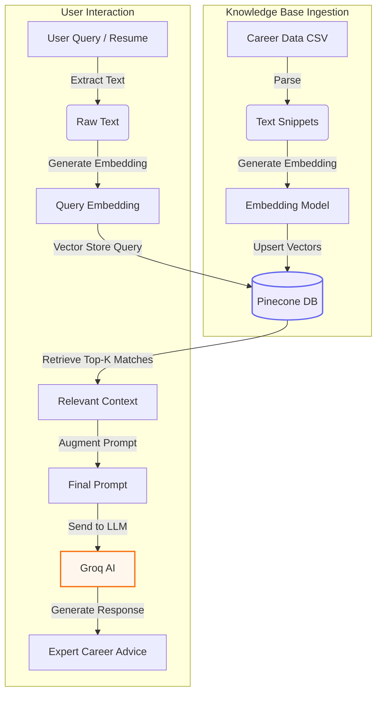
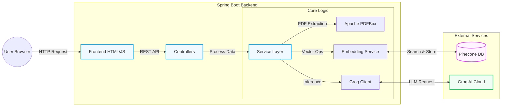

# 🚀 Career Compass – AI Job Match & Career Assistant

**Career Compass** is an AI-powered job matching and career guidance platform that helps students and early professionals evaluate how well their resume matches a job description and understand **what skills they need to improve to become job-ready**.

The project is built using a **Retrieval Augmented Generation (RAG)** architecture with **Pinecone vector search and embeddings**, combined with a **Java Spring Boot backend**, to deliver **accurate, explainable, and context-aware career guidance**.

### 🌐 [Live Demo](https://career-campass-dnah.onrender.com/)

---

## 🎯 Problem Statement

Most students apply for jobs without clear insight into:
- Whether they actually meet job skill requirements
- Why they are rejected or shortlisted
- Which skills they must learn next
- How to tailor resumes for specific roles

Traditional tools rely on basic keyword matching or generic AI feedback.  
**Career Compass solves this using RAG + Pinecone + Embeddings for reliable and meaningful results.**

---

## 🧠 What is RAG (Retrieval Augmented Generation)?

RAG improves AI accuracy by combining **information retrieval** with **text generation**.

### RAG works in three steps:
1.  **Retrieval** – Fetch relevant career knowledge from Pinecone
2.  **Augmentation** – Add retrieved knowledge to the AI prompt
3.  **Generation** – Generate a grounded response using Groq AI

This approach prevents hallucination and ensures answers are based on **real career data**.

---

## 🧩 RAG Architecture in Career Compass



---

## 🧠 Embeddings

Embeddings are numerical vector representations of text meaning.

In this project:
-   Career knowledge snippets are converted into embeddings
-   Resume text, job descriptions, and user questions are embedded
-   Pinecone performs **semantic similarity search**

This enables **meaning-based retrieval**, not just keyword matching.

---

## 🌲 Pinecone – Vector Database

Pinecone is used as the **vector database** for RAG.

### Why Pinecone?
-   Fast and scalable vector search
-   Semantic (meaning-based) retrieval
-   Ideal for RAG architectures

### Stored in Pinecone:
-   Embedded career guidance snippets
-   Metadata such as topic, category, and keywords

---

## ⚙️ Core Features

-   ✅ **Resume & Job Description Analysis**: Get a match score with fit level (Strong / Medium / Weak).
-   ✅ **Skill Gap Analysis**: Clear lists of matched and missing skills.
-   ✅ **AI Career Coach**: Context-aware chatbot using RAG.
-   ✅ **Cover Letter Generator**: Auto-generates professional letters aligned with your JD.
-   ✅ **PDF Parsing**: Securely uploads and extracts text from PDF resumes.

---

## ✉️ Cover Letter Generator

Career Compass includes an **AI-powered cover letter generator**:
-   Uses resume + job description
-   Retrieves relevant context using RAG
-   Generates professional, role-specific cover letters
-   Avoids generic or exaggerated content

---

## 🏗️ System Architecture Overview



---

## 🔌 Backend API Endpoints

### 1. Analyze Resume vs Job Description
**POST** `/api/analyze`

**Input:**
```json
{
  "jobDescription": "Senior Software Engineer...",
  "resumeText": "Experienced Java Developer..."
}
```

**Output:**
```json
{
  "score": 85,
  "matchLevel": "Strong",
  "matchedSkills": ["Java", "Spring Boot", "SQL"],
  "missingSkills": ["Kubernetes", "AWS"],
  "summary": "Strong candidate but lacks cloud experience...",
  "recommendations": ["Learn AWS basics", "Get certified in K8s"]
}
```

### 2. Career Coach (RAG Chat)
**POST** `/api/ask`
Provides **context-aware career guidance** grounded using **Pinecone retrieval and embeddings**.

### 3. Cover Letter Generator
**POST** `/api/cover-letter`
Generates a **tailored cover letter** using the resume, job description, and retrieved RAG context.

### 4. Upload Resume
**POST** `/api/upload-resume`
Uploads PDF resume and extracts text using PDFBox.

---

## 🧰 Tech Stack

### Backend
-   **Language**: Java 17
-   **Framework**: Spring Boot 3
-   **AI**: Groq AI (LLM)
-   **Utils**: Apache PDFBox

### AI & Retrieval
-   **Architecture**: Retrieval Augmented Generation (RAG)
-   **Vector DB**: Pinecone
-   **Embeddings**: High-dimensional text embeddings

### Frontend
-   **Stack**: HTML5, Vanilla CSS, JavaScript
-   **Styling**: Modern UI with Responsive Design

### Build & Tools
-   **Build**: Maven
-   **Version Control**: Git
-   **Container**: Docker support

---

## ⚙️ Setup & Execution

### Prerequisites
-   Java JDK 17 or later
-   Git
-   Maven (optional, wrapper included)

### 1. Clone Repository
```bash
git clone https://github.com/MADHAN21105/Career-Campass.git
cd Career-Campass
```

### 2. Configure API Keys
Edit `src/main/resources/application.properties`:
```properties
# AI Configuration
groq.api.key=YOUR_GROQ_API_KEY

# Pinecone Configuration
pinecone.api.key=YOUR_PINECONE_API_KEY
pinecone.environment=YOUR_ENVIRONMENT
pinecone.index=career-compass
```

### 3. Run Application
Use the Maven Wrapper:
```bash
./mvnw spring-boot:run
```

### 4. Open in Browser
Visit the local server:
```
http://localhost:8080
```

---

## 📁 Project Structure

```bash
Career-Campass
│
├── src/main/java/com/careercompass/careercompass
│   ├── config          # App Config & CORS
│   ├── controller      # REST API Endpoints
│   ├── dto             # Data Transfer Model
│   ├── service         # Business Logic & RAG Integration
│   ├── exception       # Global Error Handling
│   └── CareerCompassApplication.java
│
├── src/main/resources
│   ├── data            # Knowledge Base (CSVs)
│   ├── static          # Frontend (HTML/JS/CSS)
│   └── application.properties # Config file
│
├── pom.xml             # Dependencies
├── Dockerfile          # Docker setup
└── README.md           # Documentation
```

---

## 🎓 Educational Value

This project demonstrates:
1.  **Practical RAG Implementation**: Real-world usage of vector search.
2.  **Full-Stack Java**: robust Spring Boot backend with clean frontend integration.
3.  **Explainable AI**: Grounded responses that reduce hallucinations.
4.  **System Design**: usage of Microservices architecture patterns (Service/Controller layers).

---

## 👨‍💻 Author

**Madhan S**  
Final-Year Engineering Student | Java Backend Developer

[GitHub Profile](https://github.com/MADHAN21105)
