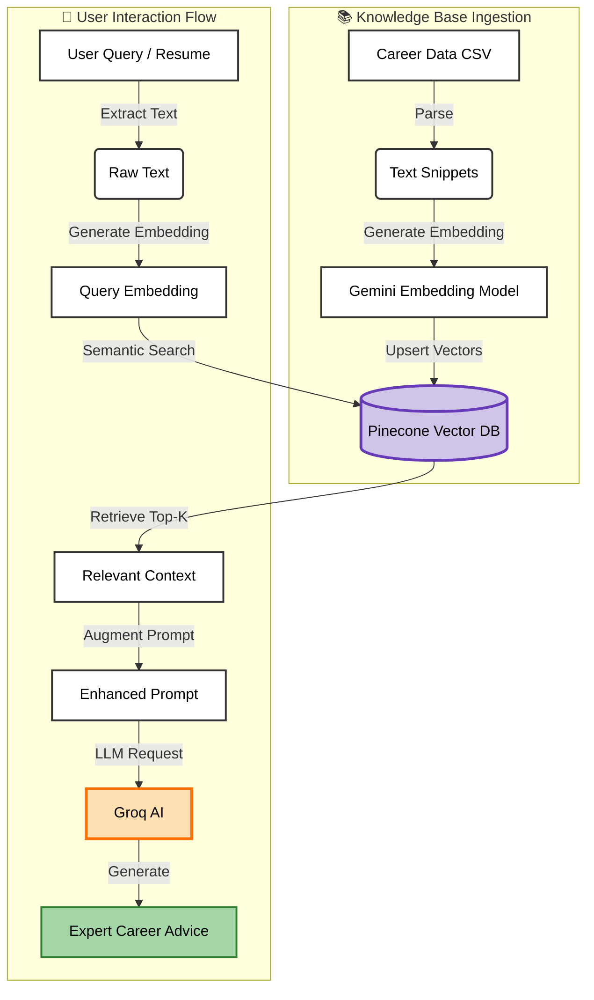
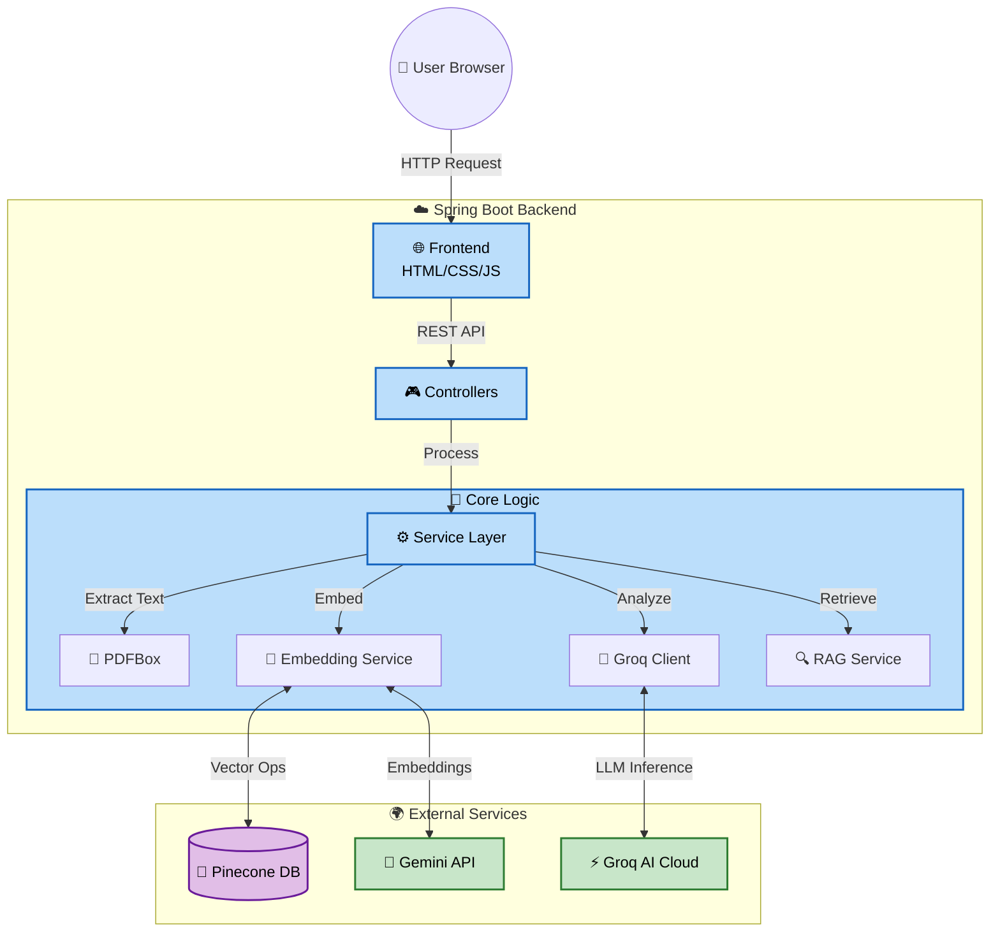

<div align="center">

# 🚀 Career Compass
### AI-Powered Job Match & Career Assistant

[](https://career-campass-dnah.onrender.com/)
[](https://www.oracle.com/java/)
[](https://spring.io/projects/spring-boot)
[](https://www.pinecone.io/)
[](https://groq.com/)

**Career Compass** is an AI-powered platform that helps students and professionals evaluate resume-job fit using **Retrieval Augmented Generation (RAG)**, **Pinecone vector search**, and **semantic embeddings** to deliver accurate, explainable career guidance.

[🎯 Features](#-key-features) • [🧩 Architecture](#-rag-architecture) • [📊 Scoring Logic](#-resume-analysis--scoring) • [⚙️ Setup](#️-setup--installation) • [📚 API Docs](#-api-endpoints)

</div>

---

## 🎯 Problem Statement

Most job seekers face critical challenges:
- ❌ **No visibility** into why they're rejected or shortlisted
- ❌ **Unclear skill gaps** - which skills to learn next?
- ❌ **Generic feedback** from traditional keyword-matching tools
- ❌ **Resume-JD mismatch** - unable to tailor applications effectively

**Career Compass solves this** using RAG + Pinecone + Embeddings for **reliable, context-aware, and explainable results**.

---

## ✨ Key Features

<table>
<tr>
<td width="50%">

### 🎯 **ATS-Style Match Score**
- Weighted scoring algorithm (0-100%)
- Industry-standard matching logic
- Breakdown by Hard Skills, Title, Education, Context

### 📊 **Deep Resume Analysis**
- Mandatory vs. Preferred skill identification
- Hierarchical education matching
- Semantic job title alignment
- Actionable improvement recommendations

### 🧠 **AI Career Coach**
- RAG-powered conversational assistant
- Context-aware career guidance
- Personalized learning paths
- Interview preparation tips

</td>
<td width="50%">

### 🔍 **Semantic Skill Matching**
- Vector-based similarity search
- Recognizes related skills (e.g., React → Frontend)
- Pinecone-powered semantic bridging
- Eliminates false negatives

### ✉️ **Cover Letter Generator**
- Role-specific professional letters
- RAG-enhanced context retrieval
- Avoids generic/exaggerated content
- Tailored to JD requirements

### 📄 **PDF Resume Parsing**
- Secure PDF text extraction
- Apache PDFBox integration
- Supports multiple formats (PDF, DOCX, TXT)
- Instant processing

</td>
</tr>
</table>

---

## 🧠 What is RAG (Retrieval Augmented Generation)?

RAG improves AI accuracy by combining **information retrieval** with **text generation**.

```mermaid
graph LR
    A[User Query] -->|1. Retrieve| B[Pinecone Vector DB]
    B -->|2. Augment| C[Context + Prompt]
    C -->|3. Generate| D[Groq AI LLM]
    D --> E[Grounded Response]
    
    style A fill:#fff,stroke:#333,stroke-width:2px,color:#000
    style B fill:#d1c4e9,stroke:#673ab7,stroke-width:2px,color:#000
    style C fill:#fff,stroke:#333,stroke-width:2px,color:#000
    style D fill:#ffe0b2,stroke:#ff6f00,stroke-width:2px,color:#000
    style E fill:#a5d6a7,stroke:#2e7d32,stroke-width:2px,color:#000
```



### How RAG Works:
1. **Retrieval** – Fetch relevant career knowledge from Pinecone
2. **Augmentation** – Add retrieved context to the AI prompt
3. **Generation** – Generate grounded response using Groq AI

**Result:** Prevents hallucination and ensures answers are based on **real career data**.

---

## 🧩 RAG Architecture in Career Compass



---

## 📊 Resume Analysis & Scoring Logic

Career Compass uses a **sophisticated weighted ATS-style scoring engine** for accurate candidate evaluation.

### 🎯 Weighted Score Breakdown (100%)

| 🏆 Pillar | ⚖️ Weight | 📝 Description |
|:----------|:---------|:--------------|
| **Hard Skills** | **60%** | Mandatory vs. Preferred skill analysis with semantic matching |
| **Job Title Alignment** | **15%** | Cosine similarity between target role and career history |
| **Education Match** | **15%** | Hierarchical degree matching (PhD > Master > Bachelor) |
| **Semantic Context** | **10%** | Overall resume-JD content similarity |

### 🔍 Intelligent Skill Matching

Unlike basic keyword scanners, Career Compass uses **Vector Semantic Search**:

✅ **Mandatory Skills** – Missing critical skills trigger dynamic score penalties  
✅ **Semantic Mapping** – Recognizes skill relationships (e.g., "Vue.js" covers "Frontend")  
✅ **Data Authority** – Cross-references gaps with authoritative knowledge base  
✅ **False Positive Prevention** – Filters noise, broad roles, and UI artifacts  

### 📈 Match Level Thresholds

| Score Range | Match Level | Interpretation |
|:------------|:------------|:---------------|
| 🏆 **80-100%** | Excellent Match | Perfect alignment, ready to apply |
| 🥇 **65-79%** | Strong Match | High potential, minor gaps |
| 🥈 **45-64%** | Good Match | Capable, needs tailoring |
| 🥉 **25-44%** | Fair Match | Moderate gaps to address |
| ⚠️ **0-24%** | Weak Match | Significant skill mismatch |

---

## 🏗️ System Architecture Overview



---

## 🔌 API Endpoints

### 1️⃣ Resume Analysis
**`POST /api/analyze`**

Analyzes resume against job description with weighted scoring.

**Request:**
```json
{
  "jobDescription": "Senior Software Engineer with 5+ years...",
  "resumeText": "Experienced Java Developer with Spring Boot..."
}
```

**Response:**
```json
{
  "score": 85,
  "matchLevel": "Excellent Match",
  "matchedSkills": ["Java", "Spring Boot", "SQL", "REST APIs"],
  "missingSkills": ["Kubernetes", "AWS", "Docker"],
  "mandatorySkills": ["Java", "Spring Boot"],
  "preferredSkills": ["Kubernetes", "AWS"],
  "summary": "Strong technical background with core skills...",
  "recommendations": ["Learn container orchestration", "Get AWS certified"],
  "hardSkillsScore": 88.5,
  "titleScore": 92.0,
  "educationScore": 100.0,
  "semanticScore": 78.3
}
```

### 2️⃣ AI Career Coach
**`POST /api/ask`**

Context-aware career guidance using RAG.

**Request:**
```json
{
  "question": "How do I transition from Java to Python?",
  "context": "5 years Java backend experience"
}
```

### 3️⃣ Cover Letter Generator
**`POST /api/cover-letter`**

Generates tailored cover letters using RAG context.

### 4️⃣ PDF Upload
**`POST /api/upload-resume`**

Extracts text from PDF resumes using Apache PDFBox.

---

## 🧰 Tech Stack

<table>
<tr>
<td>

### Backend
- ☕ **Java 17**
- 🍃 **Spring Boot 3**
- 🤖 **Groq AI** (LLM)
- 📄 **Apache PDFBox**

</td>
<td>

### AI & Retrieval
- 🧠 **RAG Architecture**
- 🌲 **Pinecone** (Vector DB)
- 💎 **Gemini** (Embeddings)
- 🔢 **Cosine Similarity**

</td>
<td>

### Frontend
- 🌐 **HTML5**
- 🎨 **Tailwind CSS**
- ⚡ **Vanilla JavaScript**
- 🎯 **Lucide Icons**

</td>
<td>

### DevOps
- 📦 **Maven**
- 🐳 **Docker**
- 🔧 **Git**
- ☁️ **Render** (Hosting)

</td>
</tr>
</table>

---

## ⚙️ Setup & Installation

### Prerequisites
- Java JDK 17+
- Git
- Maven (optional, wrapper included)

### 1️⃣ Clone Repository
```bash
git clone https://github.com/MADHAN21105/Career-Campass.git
cd Career-Campass
```

### 2️⃣ Configure API Keys
Edit `src/main/resources/application.properties`:

```properties
# Groq AI Configuration
groq.api.key=YOUR_GROQ_API_KEY

# Pinecone Configuration
pinecone.api.key=YOUR_PINECONE_API_KEY
pinecone.index.url=YOUR_PINECONE_INDEX_URL

# Gemini Embedding Configuration
gemini.api.key=YOUR_GEMINI_API_KEY
```

### 3️⃣ Run Application
```bash
# Using Maven Wrapper (Recommended)
./mvnw spring-boot:run

# Or using installed Maven
mvn spring-boot:run
```

### 4️⃣ Access Application
```
http://localhost:8080
```

---

## 📁 Project Structure

```
Career-Campass/
│
├── src/main/java/com/careercompass/careercompass/
│   ├── config/          # CORS, App Configuration
│   ├── controller/      # REST API Endpoints
│   ├── dto/             # Data Transfer Objects
│   ├── service/         # Business Logic & RAG
│   │   ├── MatchService.java          # Scoring Engine
│   │   ├── SkillAnalysisService.java  # AI Analysis
│   │   ├── RAGService.java            # Retrieval Logic
│   │   ├── EmbeddingService.java      # Vector Operations
│   │   └── GroqClient.java            # LLM Integration
│   ├── exception/       # Global Error Handling
│   └── CareerCompassApplication.java
│
├── src/main/resources/
│   ├── data/            # CSV Knowledge Base
│   │   ├── skills.csv
│   │   └── roles.csv
│   ├── static/          # Frontend Assets
│   │   ├── html/        # Pages
│   │   ├── css/         # Styles
│   │   ├── js/          # Scripts
│   │   └── images/      # Assets
│   └── application.properties
│
├── pom.xml              # Maven Dependencies
├── Dockerfile           # Container Config
└── README.md
```

---

## 🎓 Educational Value

This project demonstrates:

✅ **Practical RAG Implementation** – Real-world vector search and retrieval  
✅ **Semantic AI** – Embeddings, cosine similarity, and vector databases  
✅ **Full-Stack Java** – Spring Boot backend with clean architecture  
✅ **Explainable AI** – Grounded responses that reduce hallucinations  
✅ **System Design** – Service-oriented architecture with external APIs  

---

## 🤝 Contributing

Contributions are welcome! Please feel free to submit a Pull Request.

---

## 👨‍💻 Author

**Madhan S**  
Final-Year Engineering Student | Java Backend Developer

[](https://github.com/MADHAN21105)
[](https://www.linkedin.com/in/madhan-s11072005/)

---

<div align="center">

### ⭐ Star this repo if you find it helpful!

Made BY MADHAN S using Java, Spring Boot, Pinecone & Groq AI

</div>
