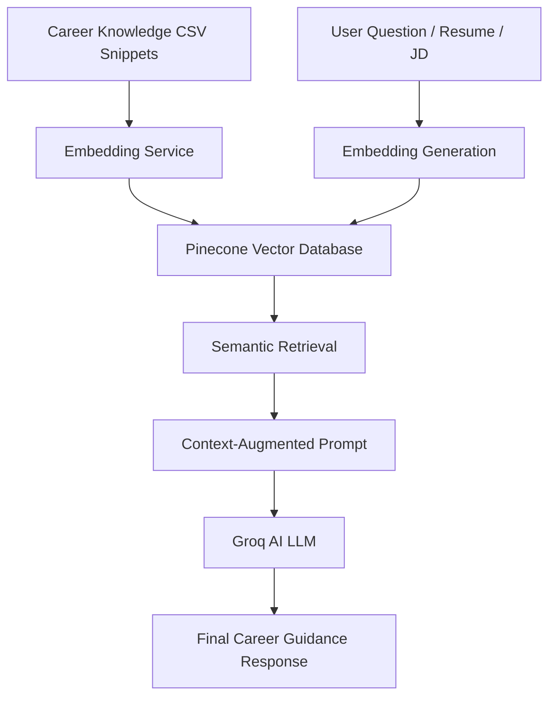
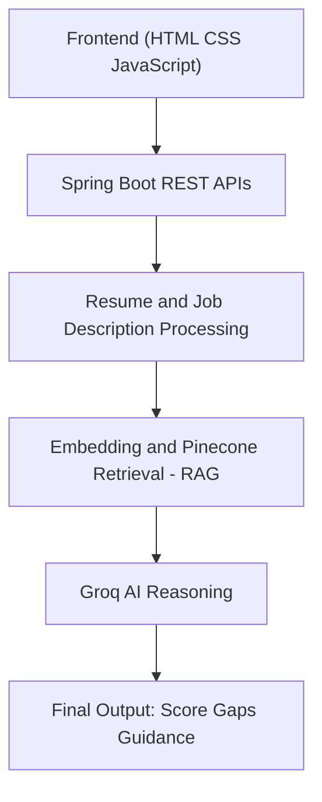

# 🚀 Career Compass – AI Job Match & Career Assistant

Career Compass is an **AI-powered job matching and career guidance platform** that helps students and early professionals evaluate how well their resume matches a job description and understand **what skills they need to improve to become job-ready**.

The project is built using a **Retrieval Augmented Generation (RAG) architecture** with **Pinecone vector search and embeddings**, combined with a **Java Spring Boot backend**, to deliver **accurate, explainable, and context-aware career guidance**.

---

## 🎯 Problem Statement

Most students apply for jobs without clear insight into:

- Whether they actually meet job skill requirements  
- Why they are rejected or shortlisted  
- Which skills they must learn next  
- How to tailor resumes for specific roles  

Traditional tools rely on basic keyword matching or generic AI feedback.  
**Career Compass solves this using RAG + Pinecone + Embeddings for reliable and meaningful results.**

---

## 🧠 What is RAG (Retrieval Augmented Generation)?

RAG improves AI accuracy by combining **information retrieval** with **text generation**.

### RAG works in three steps:
1. **Retrieval** – Fetch relevant career knowledge from Pinecone  
2. **Augmentation** – Add retrieved knowledge to the AI prompt  
3. **Generation** – Generate a grounded response using Groq AI  

This approach prevents hallucination and ensures answers are based on **real career data**.

---

## 🧩 RAG Architecture in Career Compass


---

## 🧠 Embeddings

Embeddings are numerical vector representations of text meaning.

In this project:
- Career knowledge snippets are converted into embeddings  
- Resume text, job descriptions, and user questions are embedded  
- Pinecone performs **semantic similarity search**  

This enables **meaning-based retrieval**, not just keyword matching.

---

## 🌲 Pinecone – Vector Database

Pinecone is used as the **vector database** for RAG.

### Why Pinecone?
- Fast and scalable vector search  
- Semantic (meaning-based) retrieval  
- Ideal for RAG architectures  

### Stored in Pinecone:
- Embedded career guidance snippets  
- Metadata such as topic, category, and keywords  

---

## ⚙️ Core Features

- Resume & Job Description analysis  
- Match score with fit level (Strong / Medium / Weak)  
- Clear matched and missing skill lists  
- AI-powered career coaching using RAG  
- Context-aware chatbot  
- Cover letter generator aligned with JD and resume  
- PDF resume upload and text extraction  

---

## ✉️ Cover Letter Generator

Career Compass includes an **AI-powered cover letter generator**:

- Uses resume + job description  
- Retrieves relevant context using RAG  
- Generates professional, role-specific cover letters  
- Avoids generic or exaggerated content  

---
## 🏗️ System Architecture Overview



---

## 🔌 Backend API Endpoints

### Analyze Resume vs Job Description

#### POST /api/upload-resume
Uploads PDF resume and extracts text using PDFBox.

---

### POST /api/analyze
Input:
{
  "jobDescription": "",
  "resumeText": ""
}

**Input**
```json
{
  "jobDescription": "",
  "resumeText": ""
}
```
**Output**
```json
{
  "score": 0,
  "matchLevel": "Strong | Medium | Weak",
  "matchedSkills": [],
  "missingSkills": [],
  "summary": "",
  "recommendations": []
}
```
---

### 🧠 Career Coach (RAG Chat)
```
POST /api/ask
```
Provides **context-aware career guidance** grounded using **Pinecone retrieval and embeddings**.

---

### ✉️ Cover Letter Generator
```
POST /api/cover-letter
```

Generates a **tailored cover letter** using the resume, job description, and retrieved RAG context.

---

## 🧰 Tech Stack

### Backend
- Java 17  
- Spring Boot  
- Groq AI (LLM)  
- Apache PDFBox  

### AI & Retrieval
- Retrieval Augmented Generation (RAG)  
- Pinecone Vector Database  
- Text Embeddings  

### Frontend
- HTML  
- CSS  
- Vanilla JavaScript  

### Build & Tools
- Maven Wrapper  
- Git  
- Postman  

---

## ⚙️ Setup & Execution

### Prerequisites
- Java JDK 17 or later  
- Git  

---

### Clone Repository
```bash
git clone https://github.com/MADHAN21105/Career-Campass.git
cd Career-Campass
```
---
### Configure Groq API

Edit the following file:✅ src/main/resources/application.propertiessrc/main/resources/application.properties

Add your Groq API key:

```properties
groq.api.key=YOUR_GROQ_API_KEY
```
---

### Configure Pinecone
Add the following Pinecone configuration in the same file:
```
pinecone.api.key=YOUR_PINECONE_API_KEY
pinecone.environment=YOUR_ENVIRONMENT
pinecone.index=career-compass
```
---

### Run Application
Use the Maven Wrapper included in the project:
```
./mvnw spring-boot:run
```
---

### Open in Browser
After the application starts successfully
```
open:http://localhost:8080
```
---

## 📁 Project Structure
```
Career-Campass
│
├── src/main/java/com/careercompass/careercompass
│   ├── config          # Configuration classes (CORS, AppConfig)
│   ├── controller      # REST API Controllers
│   ├── dto             # Data Transfer Objects
│   ├── service         # Business Logic & AI Services
│   ├── exception       # Global Exception Handling
│   └── CareerCompassApplication.java
│
├── src/main/resources
│   ├── data            # CSV Knowledge Base (Skills, Roles)
│   ├── static          # Frontend Assets
│   │   ├── html        # HTML Pages (Resume, Chat, Cover Letter)
│   │   ├── css         # Stylesheets
│   │   ├── js          # Frontend Logic & API calls
│   │   └── index.html  # Entry point
│   └── application.properties
│
├── pom.xml             # Maven Dependencies
├── Dockerfile          # Container Configuration
└── README.md
```
---

## 🎓 Educational Value

### This project demonstrates:

Practical implementation of Retrieval Augmented Generation (RAG)

Usage of Pinecone vector search and embeddings

Responsible and grounded AI integration

Full-stack Java application development

Explainable and interview-defensible AI architectures

---


## 👨‍💻 Author

Madhan S

Final-Year Engineering Student | Java Backend Developer

My GitHub: https://github.com/MADHAN21105  

---


